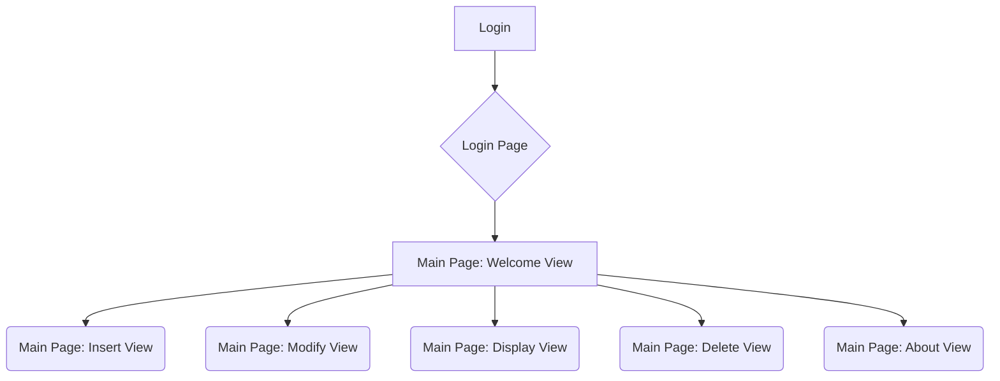

# blog_django_project
# Student Grade Management System

## System Dependency
Python3
Third Party Dependency ( written in requirements.txt)

| Depedency | Version |
|-----------|---------|
| Pillow    | 10.3.0  |

## Depolyment process

1. Install the thrid-party Library according to requirements.txt: `pip install -R requirement.txt`
2. run Django Project through execute `python manage.py runserver 8000`

## Projekt Description
Through this Django project we can deploy a personal blog.

It is a pure Django project without frontend and backend separation. 

SQLite is used as Database

## Project Structure

- blog_django_project
  - blog_app
    - views
      - home: http://127.0.0.1:8000/blog/home
      - index: http://127.0.0.1:8000/blog/index

## Chart Flow

# Database

## Table: Post
The Post in the Blog System 

Column
- title
- body
- create_time
- modified_time
- excerpt: if empty, the first 50 characters of body is used 
- views: how many times this post is viewed
- category: As ForeignKey to table Category
- tags: mapping to the name in the table Tag
- author = As ForeignKey to table User

## Table: Tag 
Tag of post

Column
- name: name of tag

## Table: Category 
Category of post

Column
- name: name of category

## Administration System

## User
http://127.0.0.1:8000/admin

| username | password | email |
|----------|----|-------|
| admin    | admin |bigberlin100@gmail.com|
|     |    |  |

## Snapchat

### Login Page

### Main Page

Welcome View

Insert View

Modify View

Display View

Delete View

About View

## Other
@Coding=UTF-8  
@Auther:Yanbo Zhu
@Time:2024-06  
@ProjectName:Personal Blog